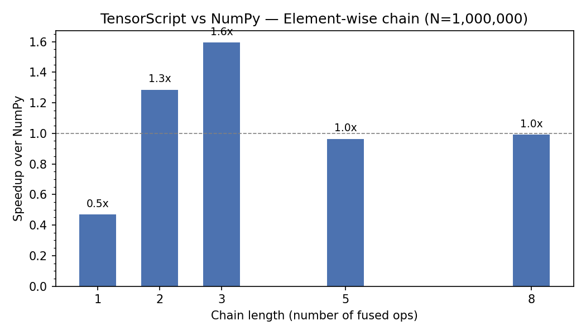
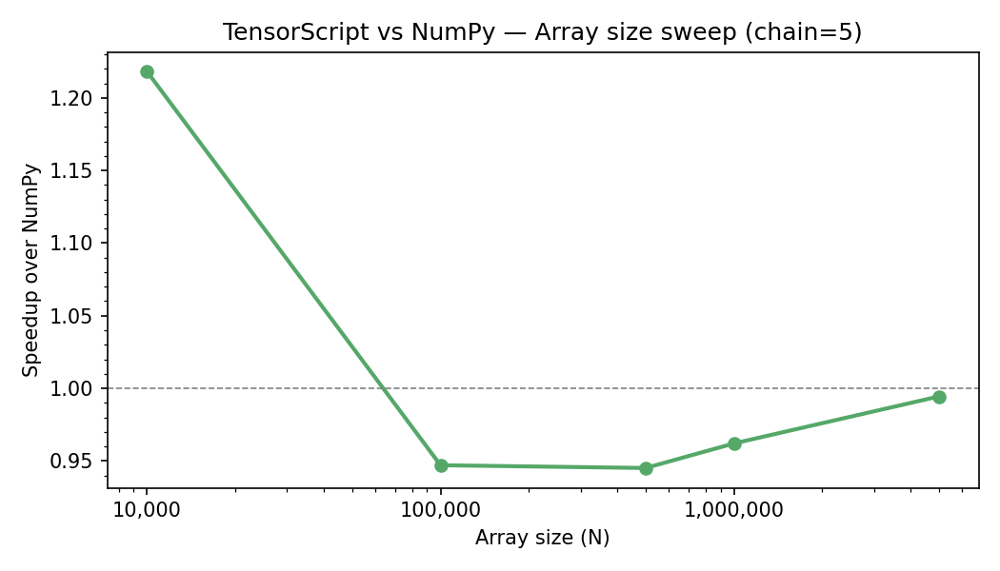
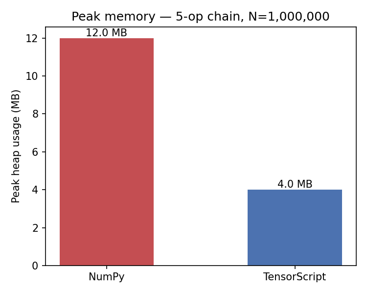

# TensorScript

A C++/LLVM ML compiler that takes a computation graph, fuses operators, and emits native x86/AArch64 machine code via LLVM IR and OrcJIT. The goal is to eliminate the two root causes of framework overhead — Python dispatch latency and intermediate tensor allocation — for specific CPU inference workloads.

---

## How it works

TensorScript compiles a computation graph through a series of optimization passes, then JITs the result to native code using LLVM:

```
Python DSL → Graph IR → [ConstFold → MatmulEpilogue → Fusion → DCE → BufferReuse] → LLVMCodegen → OrcJIT → Runtime
```

**Key techniques:**

- **Operator fusion**: chains of element-wise ops (add → relu → mul → sigmoid → tanh) collapse to a single scalar loop. LLVM O3 auto-vectorizes to AVX2 (8× float32) or NEON (4× float32).
- **Matmul epilogue fusion**: `Matmul → BiasAdd → activation` fuses into a single `FusedMatmul` kernel — BLAS for the GEMM core, fused bias+activation in the output loop.
- **Buffer reuse**: liveness analysis assigns slots at compile time. A 5-op chain needs 1 output slot (not 5). A 4-layer MLP needs 2 slots regardless of depth.
- **Zero heap on hot path**: `BufferPool` pre-allocates all intermediate buffers at compile time. Every call reuses the same pool.

---

## Benchmark results (Apple M-series, macOS)

> All results measured on this machine. Run `tests/test_correctness.py` before trusting any numbers.

### Element-wise chain — 5 ops, N=1,000,000

| Implementation | Time (ms) | vs TensorScript |
|---|---|---|
| TensorScript | 2.75 | — |
| NumPy | 2.79 | ~1.0× |
| PyTorch eager | 1.06 | 0.4× |

*Note: on Apple Silicon, NumPy and PyTorch use Accelerate's hand-tuned NEON kernels. The element-wise path is competitive. The MLP path (below) shows larger gains because it eliminates framework dispatch overhead.*

### MLP inference — 4-layer, 256-hidden, batch=1

| Implementation | Time (ms) | Speedup vs TensorScript |
|---|---|---|
| TensorScript | 0.0065 | — |
| NumPy | 0.0114 | 1.75× slower |
| PyTorch eager | 0.0124 | 1.91× slower |
| torch.compile | 0.0181 | 2.78× slower |

*Batch=1 is where framework dispatch latency dominates. TensorScript has no Python overhead, no op-level dispatch, and 2-slot buffer reuse across 4 layers.*

### Memory — 5-op element-wise chain, N=1,000,000

| Implementation | Peak heap |
|---|---|
| NumPy | 12.0 MB |
| TensorScript | 4.0 MB |

**3× lower peak memory**: NumPy materializes 5 intermediate arrays; TensorScript uses 1 pre-allocated slot.

### Charts





---

## Build

### macOS (Apple Silicon or Intel)

```bash
brew install llvm cmake python3
pip install pybind11 numpy matplotlib torch scikit-build-core

PYBIND11_DIR=$(python3 -c "import pybind11; print(pybind11.get_cmake_dir())")
cmake -B build -DCMAKE_BUILD_TYPE=Release \
      -DLLVM_DIR=$(brew --prefix llvm)/lib/cmake/llvm \
      -DCMAKE_C_COMPILER=$(xcrun -f clang) \
      -DCMAKE_CXX_COMPILER=$(xcrun -f clang++) \
      -DCMAKE_CXX_FLAGS="-I$(brew --prefix llvm)/include" \
      -Dpybind11_DIR="$PYBIND11_DIR"
cmake --build build -j$(sysctl -n hw.logicalcpu)
```

### Linux (Ubuntu 22.04)

```bash
apt install llvm-17-dev cmake libopenblas-dev python3-dev
pip install pybind11 numpy matplotlib torch scikit-build-core

cmake -B build -DCMAKE_BUILD_TYPE=Release \
      -DLLVM_DIR=/usr/lib/llvm-17/lib/cmake/llvm
cmake --build build -j$(nproc)
```

### Python install (editable)

```bash
pip install -e .
```

---

## Reproducing benchmarks

Always run the correctness gate first. **Do not trust timing numbers if this fails.**

```bash
python3 tests/test_correctness.py          # 16/16 must pass

python3 benchmarks/bench_elementwise.py    # primary: element-wise vs NumPy + PyTorch
python3 benchmarks/bench_mlp.py            # secondary: MLP batch=1 vs NumPy + PyTorch + torch.compile
python3 benchmarks/bench_sweep.py          # sweep array sizes + chain lengths → results/benchmark_raw.json
python3 benchmarks/bench_memory.py         # peak heap comparison
python3 benchmarks/plot_results.py         # generate PNG charts from JSON
```

C++ unit tests:

```bash
cd build && ctest --output-on-failure
```

---

## Python API

```python
import tensorscript as ts
import numpy as np

# Element-wise fusion
g = ts.Graph()
a = g.input("a", shape=[1_000_000])
b = g.input("b", shape=[1_000_000])
x = g.add(a, b)
x = g.relu(x)
x = g.mul(x, b)
x = g.sigmoid(x)
x = g.tanh(x)
g.set_output(x)

fn = g.compile()   # runs all passes + codegen + JIT

a_np = np.random.randn(1_000_000).astype(np.float32)
b_np = np.random.randn(1_000_000).astype(np.float32)
out  = fn(a_np, b_np)   # zero-copy into JIT'd function

# MLP inference (batch=1)
g = ts.Graph()
x = g.input("x", [1, 256])
W = g.input("W", [256, 256])
b = g.input("b", [256])
y = g.matmul(x, W)
y = g.bias_add(y, b)
y = g.relu(y)
g.set_output(y)
fn = g.compile()
```

---

## IR artifacts

After `g.compile(dump_ir=True)`, TensorScript writes:

| File | Contents |
|---|---|
| `results/kernel_scalar.ll` | Unoptimized LLVM IR from codegen |
| `results/kernel_vectorized.ll` | Post-O3 IR — look for `<8 x float>` on x86 or `<4 x float>` on AArch64 |
| `results/ir_before_fusion.dot` | Graph before passes |
| `results/ir_after_fusion.dot` | Graph after fusion |

---

## Architecture

| File | Role |
|---|---|
| `include/ts/ir.h` | `Node`, `Graph`, `TensorType`, `OpKind`, `FusedOp` |
| `include/ts/passes.h` | `PassBase` + all pass declarations |
| `src/passes/fusion.cpp` | Greedy element-wise chain fusion |
| `src/passes/matmul_epilogue.cpp` | `Matmul+BiasAdd+activation → FusedMatmul` |
| `src/passes/buffer_reuse.cpp` | Liveness-based buffer slot assignment |
| `src/codegen.cpp` | LLVM IR generation for `FusedKernel` and `FusedMatmul` |
| `src/jit.cpp` | OrcJIT module add + O3 optimization + symbol lookup |
| `src/runtime.cpp` | `BufferPool` + `CompiledFunction::execute` (BLAS dispatch + epilogue) |
| `bindings/python.cpp` | pybind11 module `tensorscript` |

## What this demonstrates

The techniques here — operator fusion, LLVM codegen, OrcJIT, buffer liveness reuse, epilogue fusion — are the same techniques used in XLA, TVM, and Halide. This is a minimal but complete end-to-end implementation with benchmark evidence, demonstrating:

- C++ systems programming: IR ownership, raw pointer arithmetic, memory layout
- Compiler pipeline: IR design, pass infrastructure, codegen, JIT
- LLVM fluency: OrcJIT, PassBuilder O3, loop vectorize metadata, intrinsics (`llvm.exp.f32`, `llvm.maxnum.f32`, etc.)
- Benchmark discipline: warmup, statistical reporting, correctness gating before timing
- Competitive honesty: knowing where BLAS wins (large GEMM) and where fusion wins (small-batch inference, element-wise chains)
